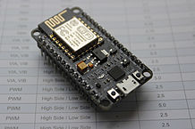
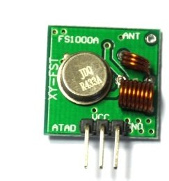

# fauxmo-esp-maplin-socket
Control Maplin Remote Socket Using Alexa

## Parts I used for this project
### ESP12E Node MCU module
These are very cheap from Ebay (~£2-3) and can be plugged into your computer using the micro usb connector for programming and powering the device.

They can be programmed using the normal Arduino IDE
### 433MHz transmitter module

These are also very cheap and can be purchase for £1-2 for a transmitter receiver pair

## How to build the code
## Schematic

