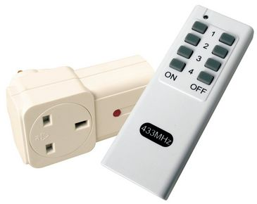
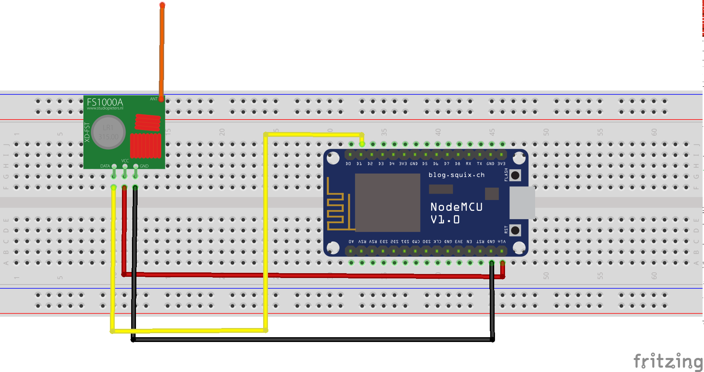

# fauxmo-esp-maplin-socket
Control Maplin Remote Socket Using Alexa

## Parts I used for this project
### ESP12E Node MCU module
These are very cheap from Ebay (~£2-3) and can be plugged into your computer using the micro usb connector for programming and powering the device.

They can be programmed using the normal Arduino IDE
### 433MHz transmitter module

These are also very cheap and can be purchase for £1-2 for a transmitter receiver pair

### Maplin Remote and Socket

Available from Maplin in the UK, pair available order code N78KA - £9.99

## How to build the code

Tested on Arduino 1.8.5 IDE
Download ESPAsyncTCP from https://github.com/me-no-dev/ESPAsyncTCP
Sketch -> Include Library -> Add Zip library
Download fauxmo library from https://bitbucket.org/bibbbi/fauxmoesp/get/5bcd3b483a69.zip
Sketch -> Include Library -> Add Zip library
In tools lwip-variant, choose v1.4 Prebuilt

## Schematic

## Setting up the maplin socket
The socket I used has two small rotary switches. In the code example given, the top dial is set to I and the bottom one to 2. See https://github.com/sui77/rc-switch/wiki/HowTo_OperateLowCostOutlets for more details.
